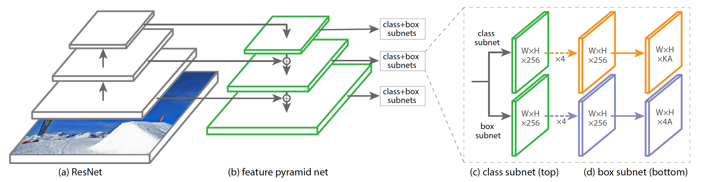
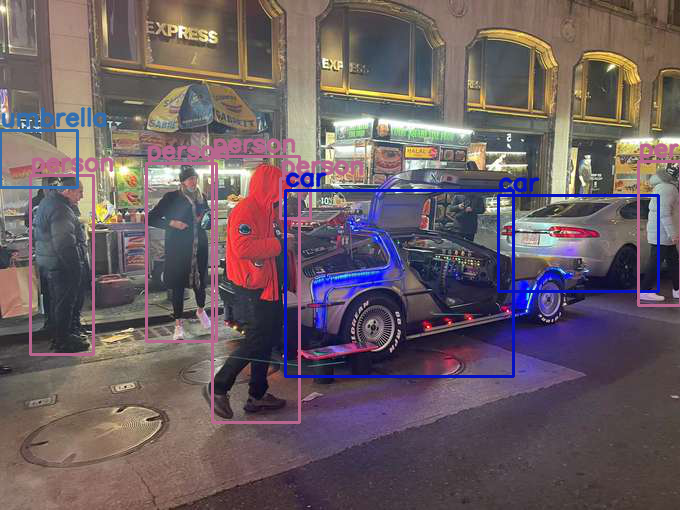
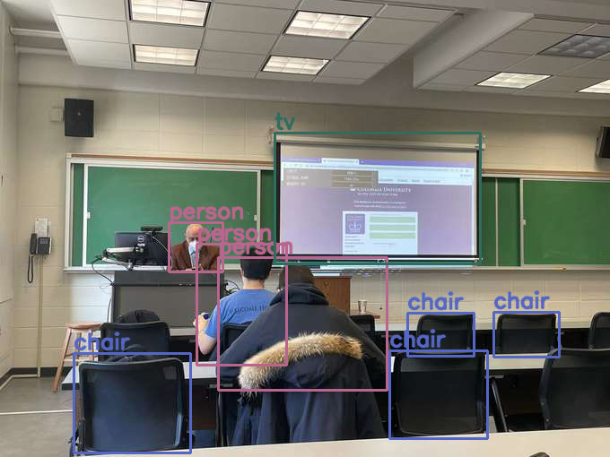

# Object Detection: RetinaNet
The RetinaNet ([Lin et al., 2018](https://arxiv.org/pdf/1708.02002.pdf)) is a one-stage dense object detector. Two crucial building blocks are featurized image pyramid and the use of focal loss.

## Team members
- Bin Li (bl2899)
- Enze Chen (ec3576)
- [Jiawei Lu](https://jiawei-lu.com) (jl5999)

## Build RetinaNet in Pytorch
[](https://colab.research.google.com/drive/14skxBfywVXqnHzGA7wKOL1BYojDzAdAz)
1. Pre-trianed ResNet-50 or Resnet-101 as Backbone

<p align="center">

</p>

2. Feature Pyramid Network
<p align="center">

</p>

- Undergoes 1×1 convolutions to reduce the channel dimensions.
- The feature maps from the bottom-up pathway and the top-down pathway are merged by element-wise addition.
- A 3×3 convolution is appended on each merged map to generate the final feature map, which is to reduce the aliasing effect of upsampling.

3. Classification and Regression Subnet

<p align="center">

</p>

4. Generate Anchors

5. Bounding Box Transformation

6. Focal Loss

## Train the model

### Training on COCO dataset
You can run the shell file `train.sh` or run the python file `train.py` by using
```
python train.py --dataset coco --coco_path ./coco --depth 50
```

### Pre-trained model
A pre-trained model is available here in Google Drive, 
- [https://drive.google.com/open?id=1yLmjq3JtXi841yXWBxst0coAgR26MNBS](https://drive.google.com/open?id=1yLmjq3JtXi841yXWBxst0coAgR26MNBS) (this is a pytorch state dict)

The state dict model can be loaded using:
```
retinanet = model.resnet50(num_classes=dataset_train.num_classes(),)
retinanet.load_state_dict(torch.load(PATH_TO_WEIGHTS))
```

## Evaluate the model
Run `coco_validation.py` to validate the code on the COCO dataset. With the above model, run:
```
python coco_validation.py --coco_path ~/path/to/coco --model_path /path/to/model/coco_resnet_50_map_0_335_state_dict.pt
```

This produces the following results:
```
 Average Precision  (AP) @[ IoU=0.50:0.95 | area=   all | maxDets=100 ] = 0.346
 Average Precision  (AP) @[ IoU=0.50      | area=   all | maxDets=100 ] = 0.516
 Average Precision  (AP) @[ IoU=0.75      | area=   all | maxDets=100 ] = 0.369
 Average Precision  (AP) @[ IoU=0.50:0.95 | area= small | maxDets=100 ] = 0.180
 Average Precision  (AP) @[ IoU=0.50:0.95 | area=medium | maxDets=100 ] = 0.381
 Average Precision  (AP) @[ IoU=0.50:0.95 | area= large | maxDets=100 ] = 0.486
 Average Recall     (AR) @[ IoU=0.50:0.95 | area=   all | maxDets=  1 ] = 0.306
 Average Recall     (AR) @[ IoU=0.50:0.95 | area=   all | maxDets= 10 ] = 0.487
 Average Recall     (AR) @[ IoU=0.50:0.95 | area=   all | maxDets=100 ] = 0.530
 Average Recall     (AR) @[ IoU=0.50:0.95 | area= small | maxDets=100 ] = 0.339
 Average Recall     (AR) @[ IoU=0.50:0.95 | area=medium | maxDets=100 ] = 0.581
 Average Recall     (AR) @[ IoU=0.50:0.95 | area= large | maxDets=100 ] = 0.699
 ```
 
Currently, this repo achieves 33.5% mAP at 600px resolution with a Resnet-50 backbone. The published result is 34.0% mAP. The difference is likely due to the use of Adam optimizer instead of SGD with weight decay.


## Demo Result   
[](https://colab.research.google.com/drive/10254ZBJSeS_J71ioVjdcNI7m8R_dcZYi)

<p align="center">

</p>

<p align="center">

</p>


## Reference
[1] [Focal Loss for Dense Object Detection](https://arxiv.org/pdf/1708.02002.pdf)

[2] [Object Detection Part 4: Fast Detection Models](https://lilianweng.github.io/lil-log/2018/12/27/object-detection-part-4.html)

[3] [Object Detection using RetinaNet with PyTorch and Deep Learning](https://debuggercafe.com/object-detection-using-retinanet-with-pytorch-and-deep-learning/)

[4] [Review: RetinaNet — Focal Loss (Object Detection)](https://towardsdatascience.com/review-retinanet-focal-loss-object-detection-38fba6afabe4)

[5] [Object detection: speed and accuracy comparison(Faster R-CNN, R-FCN, SSD, FPN, RetinaNet and YOLOv3)](https://jonathan-hui.medium.com/object-detection-speed-and-accuracy-comparison-faster-r-cnn-r-fcn-ssd-and-yolo-5425656ae359)

[6] [FAIR Detectron GitHub](https://github.com/facebookresearch/Detectron/blob/main/detectron/modeling/retinanet_heads.py)

[7] [YouTube: Focal Loss for Dense Object Detection](https://www.youtube.com/watch?v=44tlnmmt3h0)

[8] [Pytorch RetinaNet](https://github.com/yhenon/pytorch-retinanet)
